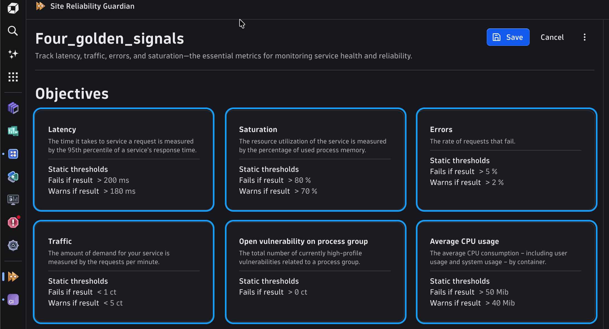
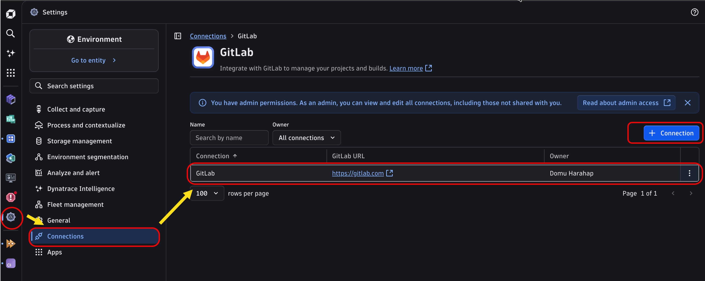
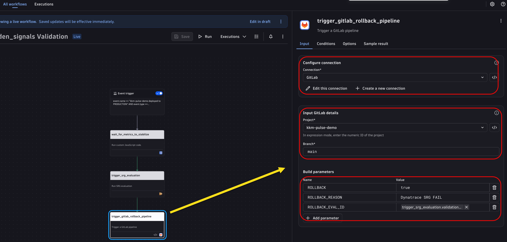

--8<-- "snippets/dt-enablement.md"

# Use Case 7 — Site Reliability Guardian & Automated Rollback

The pipeline now deploys to production with a human approval gate and a load-test quality check. But what happens *after* the deployment completes? Even when pre-deployment gates pass, real production traffic can reveal issues — elevated latency, higher error rates, or newly-detected security vulnerabilities — that only emerge under genuine load.

**Site Reliability Guardian (SRG)** is Dynatrace's automated post-deployment validation engine. It evaluates a deployment against a set of objectives anchored to real observability data — including security posture — and returns a binary **PASS / FAIL** verdict. A **Dynatrace Workflow** triggers that evaluation automatically on every deployment event and, if production fails its objectives, calls the GitLab API to kick off a rollback pipeline — no human in the loop.

In this use case you will:

1. Create a Guardian in Dynatrace and define objectives — error rate, response time, and critical security vulnerabilities
2. Build a Dynatrace Workflow that evaluates the Guardian automatically after every production deployment
3. Test the PASS and FAIL paths
4. Extend the Workflow to call the GitLab API and trigger a rollback when the evaluation fails
5. Add a rollback job to the pipeline that runs only when Dynatrace fires

---

## 1. Create a Site Reliability Guardian

In Dynatrace, navigate to **Apps → Site Reliability Guardian** (search for it in the app launcher if it isn't pinned).

Click **+ New Guardian**, then choose **Choose Template** and select **Four Golden Signals**.


On the **Getting started with template** popup, click **Run Query**, select **kkm-pulse-demo**, and click **Apply Template**.


### Configure the four golden signal objectives

The template pre-creates four objectives. Set the **Fails if result** and **Warning if result** thresholds for each one as shown below.

#### Objective 1 — Latency

| Field | Value |
|---|---|
| **Name** | `Latency` |
| **Fails if result** | `> 500` |
| **Warning if result** | `> 300` |

#### Objective 2 — Saturation

| Field | Value |
|---|---|
| **Name** | `Saturation` |
| **Fails if result** | `> 80` |
| **Warning if result** | `> 70` |

#### Objective 3 — Errors

| Field | Value |
|---|---|
| **Name** | `Errors` |
| **Fails if result** | `> 5` |
| **Warning if result** | `> 2` |

#### Objective 4 — Traffic

| Field | Value |
|---|---|
| **Name** | `Traffic` |
| **Fails if result** | `< 1` |
| **Warning if result** | `< 5` |


!!! info "Threshold units"
    Latency thresholds are in **milliseconds**. Saturation and Errors thresholds are in **percentage (%)** of requests or resource usage. Traffic is a **request-per-minute** floor — a value below this indicates the service is not receiving meaningful load and may have stalled.

### Add custom objectives

Click **Add More objective** for each of the two below.

#### Objective 5 — Average CPU Usage

| Field | Value |
|---|---|
| **Name** | `Average CPU usage` |
| **DQL** | `timeseries val = avg(dt.kubernetes.container.cpu_usage, default: 0), filter: in(dt.smartscape.k8s_namespace, { toSmartscapeId("<<NAMESPACE_ID_TO_REPLACE>>>") }) | fields avg = arrayAvg(val)` |
| **Fails if result** | `> 50` |
| **Warning if result** | `> 40` |

#### Objective 6 — Critical Security Vulnerabilities

| Field | Value |
|---|---|
| **Name** | `Critical Vulnerabilities` |
| **DQL** | `fetch security.events | filter event.provider=="Dynatrace" | filter event.kind=="SECURITY_EVENT" | filter event.type=="VULNERABILITY_STATE_REPORT_EVENT" | filter event.level=="ENTITY" | fieldsAdd matcher="match" | lookup [ fetch security.events | filter event.provider=="Dynatrace" | filter event.kind=="SECURITY_EVENT" | filter event.type=="VULNERABILITY_STATE_REPORT_EVENT" | filter event.level=="ENTITY" | fields maxTimestamp=timestamp, matcher="match" | limit 1 ], sourceField:matcher, lookupField:matcher, fields:{maxTimestamp} | filter timestamp==maxTimestamp | filter event.status=="OPEN" | filter in(vulnerability.risk.level,{"CRITICAL","HIGH"}) | filter in(affected_entity.id, {"PROCESS_GROUP-A085A3959D385BE8"}) | summarize Filtered_high-profile_vulnerabilities=arraySize(collectDistinct(vulnerability.id))` |
| **Fails criterion** | `> 0` |



!!! info "Application Security required"
    The security objective requires **Dynatrace Application Security** to be enabled. If it's unavailable on your tenant, skip this objective — the error rate and latency objectives are sufficient for the workshop. The principle (SRG can gate on security KPIs the same way it gates on performance KPIs) is the key takeaway.

Save the Guardian. You will select it by name in the Workflow's Site Reliability Guardian action in Section 3.

---

## 2. Create credentials

### Platform token (for Workflow to trigger SRG)

In Dynatrace: **Settings → Access tokens → Generate new token**

| Field | Value |
|---|---|
| **Name** | `kkm-pulse-demo SRG workflow` |
| **Scopes** | `Davis data: Read` · `Site Reliability Guardian: Read evaluations` · `Site Reliability Guardian: Write evaluations` |

In the `kkm-pulse-demo` GitLab project, add two CI/CD variables:

| Key | Value | Mask? |
|---|---|---|
| `DT_PLATFORM_TOKEN` | the token you just generated | Yes |
| `SRG_WORKFLOW_ID` | the ID of the Dynatrace Workflow that contains the Site Reliability Guardian action (the UUID in the Workflow URL, e.g., `xxxxxxxx-xxxx-xxxx-xxxx-xxxxxxxxxxxx`) | No |

!!! note "Workflow ID instead of Guardian ID"
    The Guardian ID is no longer used. The Site Reliability Guardian is run as an action inside the Workflow, so you only need the **Workflow ID** and the platform token. You get the Workflow ID from the browser URL (`.../ui/apps/dynatrace.automations/workflows/<WORKFLOW_ID>`) once you create the Workflow in [Section 3](#3-create-a-workflow-to-evaluate-srg-after-deployment) — come back and set this variable then.


### GitLab connection (for Workflow to trigger rollback pipeline)

The native **GitLab** Workflow action requires a pre-configured connection rather than a raw trigger token. This approach handles authentication through the connector and lets you select project and variables as structured fields — no manual HTTP construction needed.

In GitLab: **User icon → Edit profile → Access tokens → Add new token**

| Field | Value |
|---|---|
| **Token name** | `Dynatrace Workflow rollback` |
| **Scopes** | `api` |

Copy the generated token.

In Dynatrace: **Apps → Connections → + New connection → GitLab**

| Field | Value |
|---|---|
| **Connection name** | `GitLab kkm-pulse-demo` |
| **GitLab URL** | `https://gitlab.com` |
| **Personal access token** | the token you just copied |

Save the connection. It appears in the action picker as a selectable credential — the token is stored encrypted and never exposed in Workflow logs or definitions.



---

## 3. Create a Workflow to evaluate SRG after deployment

The pipeline's `notify-dynatrace-prod-deploy` job already sends a `CUSTOM_DEPLOYMENT` event to Dynatrace every time a production deployment completes. You will now create a Workflow that listens for that event and runs an SRG evaluation automatically — no pipeline polling required.

In Dynatrace: **Apps → Workflows → + New Workflow**

### Trigger — Event-based

| Field | Value |
|---|---|
| **Event type** | `Custom deployment event` |
| **Filter condition** | `event.name == "kkm-pulse-demo deployed to PRODUCTION" AND event.type == "CUSTOM_DEPLOYMENT"` |

This fires once for every deployment the `notify-dynatrace-prod-deploy` job sends.


### Action 1 — Wait for metrics to stabilize

Add a **JavaScript** action and paste:

```js
import { execution } from "@dynatrace-sdk/automation-utils";

export default async function () {
  // Allow 120 s for post-deployment metrics to propagate
  await new Promise(r => setTimeout(r, 60_000));
  return { waited: true };
}
```

| Field | Value |
|---|---|
| **Label** | `Wait for metrics to stabilize` |


### Action 2 — Trigger SRG evaluation

Add a **Site Reliability Guardian — Run evaluation** action (search for it in the action picker).

| Field | Value |
|---|---|
| **Label** | `Run SRG evaluation` |
| **Guardian** | select `kkm-pulse-demo production` |
| **Timeframe from** | `event.event.start` |
| **Timeframe to** | `now()` |

The action completes when the evaluation finishes and exposes the result as `{{ result("Run SRG evaluation").executionStatus }}`.


!!! tip "What does the result look like?"
    The SRG action output includes `executionStatus` (`PASS` or `FAIL`), `totalScore`, and a per-objective breakdown. You can inspect it in **Workflow executions → select a run → Action 2 → Output**.

Save and **activate** the Workflow.

### Test the first step

Push a trivial commit to trigger the pipeline through to production, approve the Use Case 6 manual gate, and let `notify-dynatrace-prod-deploy` run.

In Dynatrace: **Apps → Workflows → kkm-pulse-demo SRG → Executions** — a new execution should appear within seconds. After ~2 minutes wait plus evaluation time, the execution completes. Open it and check:

- Action 1 output: `{ "waited": true }`
- Action 2 output: `Guardian validation finished, total result:` is `PASS` (if production is healthy)

In **Apps → Site Reliability Guardian → kkm-pulse-demo production** you can see the evaluation listed with its per-objective results.

---

## 4. Force a failing evaluation

Spike the application while an evaluation is running to see the `FAIL` path:

```bash
for i in $(seq 1 8); do
  curl -H "Host: kkm-pulse-prod.127.0.0.1.sslip.io" http://localhost/api/trigger-anomaly &
done
wait
```

Trigger another pipeline run (or re-run the Workflow manually). The latency objective will breach its threshold; the SRG returns `FAIL`; Action 2 output shows `executionStatus: FAIL`.

!!! tip "SRG vs. the load test"
    The load test in Use Case 5 measures what *your curl loop* observed — a synthetic sample under controlled conditions. SRG evaluates metrics Dynatrace collected from *real application traffic* during the evaluation window. These are complementary gates: the load test catches obvious breakage early; SRG catches subtle regressions that only appear under concurrent production load.

---

## 5. Extend the Workflow to trigger a GitLab rollback

With the evaluation result available, add a conditional action that calls the GitLab trigger API only when SRG fails.

Open the Workflow in edit mode and add **Action 3**.

### Action 3 — Trigger GitLab rollback (conditional)

Before adding this action, two one-time setup steps are required in Dynatrace: enabling the GitLab connection and allowlisting the outbound GitLab URL.

#### Step A — Verify the GitLab connection is available

The connection you created in Section 2 must be visible to Workflows. Confirm it in:

**Apps → Connections** — the `GitLab kkm-pulse-demo` entry should show **Status: Connected**.

If it is missing, re-create it following the steps in [Section 2 — GitLab connection](#2-create-credentials).


#### Step B — Add GitLab to the external request allowlist

Dynatrace Workflows block outbound HTTP calls to unlisted hosts by default. You must explicitly allowlist `gitlab.com` before the GitLab action can fire.

In Dynatrace: **Settings → Workflows → External request allowlist → + Add entry**

| Field | Value |
|---|---|
| **URL pattern** | `https://gitlab.com` |
| **Description** *(optional)* | `GitLab API — rollback pipeline trigger` |

Click **Save changes**. The allowlist applies tenant-wide; any Workflow can now reach `gitlab.com` through the outbound connector.

!!! warning "Missing allowlist entry = silent action failure"
    If `gitlab.com` is not allowlisted, the GitLab action silently fails with a connectivity error instead of surfacing a clear message. If Action 3 completes without a corresponding GitLab pipeline appearing, check **Settings → Workflows → External request allowlist** first.

---

Now add the action itself.

Add a **GitLab — Trigger a new pipeline** action (search for "GitLab" in the action picker — it appears under the GitLab connector):

| Field | Value |
|---|---|
| **Label** | `Trigger GitLab rollback pipeline` |
| **Run condition** | `{{ result("trigger_srg_evaluation")["validation_status"] == "fail" }}` |
| **Connection** | `GitLab kkm-pulse-demo` |
| **Project** | select `kkm-pulse-demo` (or enter the project path `your-group/kkm-pulse-demo`) |
| **Ref** | `main` |

Under **Variables**, add three entries:

| Key | Value |
|---|---|
| `ROLLBACK` | `true` |
| `ROLLBACK_REASON` | `Dynatrace SRG FAIL` |
| `ROLLBACK_EVAL_ID` | `{{ result("Run SRG evaluation").validation_id }}` |



!!! info "Why the GitLab connector action over HTTP Request"
    The native GitLab action uses the pre-configured connection for authentication — no manual token passing, no form-encoded body to construct, and no project ID to look up. Variables are set as structured key-value pairs and injected by GitLab the same way as with the trigger API. The Workflow stays readable and the credential is managed centrally in the connection settings.

**Action 4 (optional) — Send notification**: chain a Slack or email notification so on-call is alerted the moment the Workflow fires.

Save and re-activate the Workflow.

!!! tip "Catching Davis AI problems too"
    Add a second event trigger for **Davis Problem** events filtered by entity `kkm-pulse-demo`. This catches issues Davis detects independently of SRG — for example, a memory leak that only becomes visible two hours after deployment — and calls the same rollback action.

---

## 6. Add a rollback job to the pipeline

The Workflow injects `ROLLBACK=true`, `ROLLBACK_REASON`, and `ROLLBACK_EVAL_ID` as pipeline variables when it calls the GitLab trigger API. Add a conditional job that only runs when Dynatrace fires:

```yaml title=".gitlab-ci.yaml (append)" linenums="1"
stages:
  - build
  - test
  - code_quality
  - package
  - deploy_dev
  - load_test
  - deploy_prod
  - rollback

rollback-prod:
  stage: rollback
  tags:
    - shell
  rules:
    - if: '$ROLLBACK == "true"'
  script:
    - echo "Rollback triggered by Dynatrace — reason: ${ROLLBACK_REASON} (eval ${ROLLBACK_EVAL_ID})"
    - echo "Rolling back kkm-pulse-prod to previous ReplicaSet..."
    - kubectl rollout undo deployment/kkm-pulse-demo -n kkm-pulse-prod
    - kubectl rollout status deployment/kkm-pulse-demo -n kkm-pulse-prod --timeout=120s
    - 'curl -sf -H "Host: kkm-pulse-prod.127.0.0.1.sslip.io" http://localhost/api/status'
    - echo "Rollback complete — notifying Dynatrace..."
    - DT_TENANT=$(echo "$DT_ENVIRONMENT" | sed -E 's/\.apps\./.live./; s#/$##')
    - >
      curl -sf -X POST "${DT_TENANT}/api/v2/events/ingest"
      -H "Authorization: Api-Token ${DT_INGEST_TOKEN}"
      -H "Content-Type: application/json"
      -d "{\"eventType\":\"CUSTOM_DEPLOYMENT\",\"title\":\"kkm-pulse-demo ROLLBACK triggered by Dynatrace\",\"properties\":{\"dt.event.deployment.name\":\"kkm-pulse-demo\",\"environment\":\"prod\",\"reason\":\"${ROLLBACK_REASON}\",\"triggered_by\":\"Dynatrace Workflow\",\"srg_evaluation_id\":\"${ROLLBACK_EVAL_ID}\"}}"
```

```bash
git add .gitlab-ci.yaml
git commit -m "ci: add Dynatrace-triggered rollback job"
git push
```

Normal pipeline runs skip `rollback-prod` entirely because `$ROLLBACK` is unset. Only the Dynatrace Workflow-triggered pipeline runs it.

---

## 7. Test the end-to-end loop

1. **Deploy to production** — push a change, run through the pipeline, approve the manual gate, let `notify-dynatrace-prod-deploy` complete

2. **Watch the Workflow fire** — in **Apps → Workflows → kkm-pulse-demo SRG → Executions**, a new execution starts within seconds

3. **Simulate a sustained anomaly** after the pipeline finishes:
    ```bash
    for i in $(seq 1 15); do
      curl -H "Host: kkm-pulse-prod.127.0.0.1.sslip.io" http://localhost/api/trigger-anomaly &
    done
    wait
    ```

4. **Re-trigger the Workflow manually** (or wait for the next deployment). After the SRG evaluation completes with `FAIL`, Action 3 fires.

5. **Watch GitLab** — **CI/CD → Pipelines** shows a new pipeline (branch: `main`, triggered by API) with only the `rollback-prod` job.

6. **Verify the rollback**:
    ```bash
    kubectl rollout history deployment/kkm-pulse-demo -n kkm-pulse-prod
    curl -H "Host: kkm-pulse-prod.127.0.0.1.sslip.io" http://localhost/api/status
    ```

7. **See the rollback event in Dynatrace** — in the `kkm-pulse-demo` service timeline, the `CUSTOM_DEPLOYMENT` rollback event appears alongside the SRG evaluation. The `srg_evaluation_id` property links you directly to the evaluation that triggered it — a complete audit trail with no manual correlation.

This closes the **deploy → observe → act** loop entirely within Dynatrace and GitLab, with no human intervention required.

---

## What you've built

| Capability | Implementation |
|---|---|
| Automated post-deployment validation | Workflow triggers SRG evaluation on every `CUSTOM_DEPLOYMENT` event from the pipeline |
| SRG evaluates real production traffic | Error rate, response time, and security vulnerabilities measured against defined objectives |
| Security vulnerability as a quality gate | SRG objective counts critical CVEs — a deployment with unresolved critical vulnerabilities fails the gate |
| Proactive rollback for post-pipeline issues | Workflow fires on SRG FAIL → calls GitLab trigger API → `rollback-prod` job runs |
| Secure credential handling | GitLab PAT stored in a Dynatrace Connection, never exposed in logs or Workflow definitions — the native GitLab action references the connection by name |
| Full observability of the rollback itself | `rollback-prod` sends a `CUSTOM_DEPLOYMENT` event back to Dynatrace with the SRG evaluation ID — rollback is visible on the service timeline and cross-linked to the evaluation that caused it |

---

## Knowledge Check

### Question 1 — Why does the Workflow wait 120 seconds before triggering the SRG evaluation?

The JavaScript action waits two minutes before the SRG evaluate action runs. Explain what category of incorrect results becomes more likely if you remove this wait.

??? question "Show Answer"

    SRG evaluates metrics that Dynatrace collected **during the evaluation time window** (`timeframeFrom` to `timeframeTo`). Immediately after a deployment:

    - The newly deployed Pod may still be in its startup phase — the first few requests are handled during JIT compilation, connection-pool warmup, and DNS resolution, producing artificially high latency and a spike in error rate.
    - Dynatrace's metrics pipeline ingests and aggregates data with a small delay; some data points from the first seconds of traffic may not have arrived in the platform yet when the evaluation window closes.

    **Without the wait, you risk a false FAIL:**

    The evaluation window captures the startup noise — elevated latency and possibly some 5xx responses during Pod initialization — and compares it against steady-state thresholds. A healthy deployment can fail its SRG objectives simply because the evaluation ran too early.

    **Why not wait even longer?**

    A longer wait delays feedback. 120 seconds is a pragmatic balance: enough time for the application to reach steady state and for metrics to propagate through the Dynatrace ingest pipeline, but short enough that the feedback loop remains useful. In production, tune this to match your application's actual warm-up profile.

    **Rule of thumb:** set the wait to *at least* the time it takes for your application's error rate to stabilize after a cold start, plus 30–60 seconds for metric ingestion latency.

---

### Question 2 — Hands-on: Add a Slack notification to the rollback Workflow

The Workflow currently triggers a GitLab rollback but sends no human-readable alert. Extend **Action 4** (the optional notification step) so on-call receives a Slack message that includes:

1. Which Guardian evaluation failed (`{{ result("Run SRG evaluation").validation_id }}`)
2. The total score (`{{ result("Run SRG evaluation").totalScore }}`)
3. A direct link to the evaluation in Dynatrace

Show the Workflow action configuration and the message template you would use.

??? question "Show Answer"

    Add a **Send Slack message** action (requires the Slack connector to be configured in your tenant):

    | Field | Value |
    |---|---|
    | **Label** | `Notify on-call of rollback` |
    | **Run condition** | `{{ result("Run SRG evaluation").executionStatus == "FAIL" }}` |
    | **Channel** | `#oncall-alerts` |

    Message body:

    ```
    :rotating_light: *kkm-pulse-demo production rollback triggered*

    SRG evaluation `{{ result("Run SRG evaluation").validation_id }}` returned *FAIL* (score: {{ result("Run SRG evaluation").totalScore }}).

    GitLab rollback pipeline has been triggered automatically.

    View evaluation: {{ your-tenant }}/ui/srg/evaluations/{{ result("Run SRG evaluation").validation_id }}
    ```

    **Why this matters:**

    The Workflow handles the mechanical rollback without waking anyone up, but on-call still needs to know a rollback happened and why. The Slack message provides the evaluation link so they can go straight to the per-objective breakdown — no manual searching in Dynatrace.

---

## Recap — all six use cases together

Across six use cases you took `kkm-pulse-demo` from zero to a fully observable, self-healing pipeline:

1. **Use Case 1** — Pipeline stages, jobs and artifacts built step by step in the GitLab Web IDE
2. **Use Case 2** — GitLab project and a self-hosted runner registered over SSH
3. **Use Case 3** — Build, test, SAST, and SonarQube quality gate on every push
4. **Use Case 4** — Docker image built in CI, loaded into k3d, deployed and exposed on Kubernetes
5. **Use Case 5** — Dynatrace OneAgent, deployment events, load test graded against an error budget
6. **Use Case 6** — Separate dev/prod environments with a structural gate: a bad build can never reach the ▶️ button
7. **Use Case 7** — Dynatrace Workflow evaluates SRG on every deployment; triggers GitLab rollback automatically when production degrades

Use Case 8 goes further: SRG moves upstream and blocks the merge itself — broken releases never reach `main`.

<div class="grid cards" markdown>
- [Continue to Use Case 8 — Blue-Green Deployment with SRG Pre-Merge Gate :octicons-arrow-right-24:](usecase8-blue-green-srg.md)
</div>
